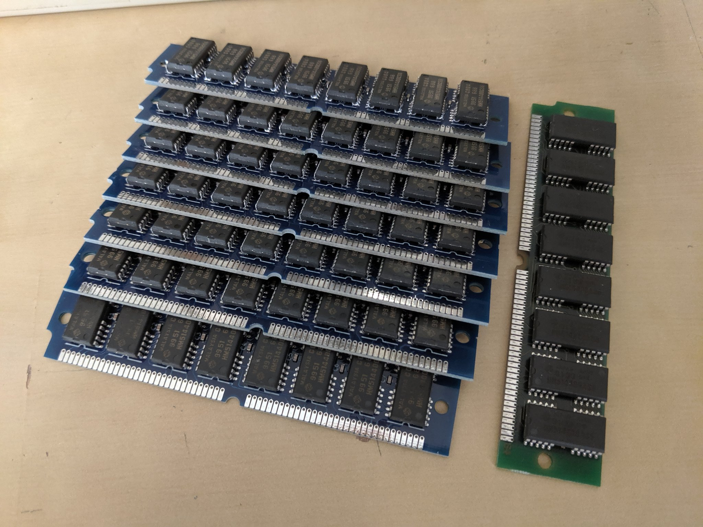

# GVP-Compatible 64-Pin 4MB SIMM

GVP (Great Valley Products) made a number of Amiga accelerator cards back
in the 80s and 90s. Many of the accelerator cards accept 64-pin
memory modules; however they do not follow a standard pinout.

These GVP proprietary SIMMS are somewhat hard to find and expensive when
they do turn up. Others have reverse engineered the design, but these clones
use CAD tools that are not open source.

This design is based on a 4MB SIMM that came from my own GVP 68030
accelerator card. You can see my [epic build thread on Twitter](https://twitter.com/TubeTimeUS/status/1154195947125002240).

(The original SIMM is on the right, and on the left are my clones.)

Design files are here:

[Schematic](gvpsimm.pdf)

[Fab files](fab/gvpsimm_rev1.zip)

Board dimensions are 3.85 x 0.875 inches, and it is a 4 layer board. When
ordering the board, remember to specify a board thickness of 1.2mm. This
ensures it will fit in the SIMM slot.

## DRAM Chips

My original SIMM module uses the Hitachi HM514400CS-6 memory chips, which
are 1 Meg x 4 bit 60ns devices. Since there are eight memory chips, this
results in a memory array of 1 Meg x 32 bit, or 4 megabytes. I have built and
tested a large number of SIMMs with these chips and they all work fine.

There exist a number of memory chips which I have not tested (beware!) but are
likely compatible:
* Samsung KM44C1000DJ-6
* Mitsubishi M5M44400CJ-6
* NEC PD424400LA-60
* Toshiba TC514400ASJ-60
* TI TMS44400-60 DJ
* Micron MT4C4001JDJ-6

The list is from [this thread at Abime](http://eab.abime.net/showthread.php?t=86182).

## 1MB Variant

There exist 256K x 4 bit memories in the same package that are pin
compatible with the larger chip, and it can be installed instead,
yielding a 1MB SIMM. The difference is that pin 5 (A9 address line) is a
no-connect. I have not tested this configuration, but if you want to try it, I
found a couple of memory chips that might work.

* Samsung KM44C256DJ-6
* TI TMS44C256-60 DJ
* Mitsubishi M5M44256AJ-6

## Bypass Capacitors

Others have mistakenly assumed that the original GVP SIMM has no bypass
capacitors. This is not true--on detailed inspection I observed eight
ultra-low profile ceramic capacitors soldered directly underneath the
memory chips.

Ultra-low profile ceramic capacitors are hard to find now, and would
make assembly somewhat difficult. Instead of this I opted to use seven
standard 0603 ceramic capacitors placed in between the memory chips.
For best results, use 0.22uF or larger. Ensure the voltage rating is 10V
or higher, as 6.3V ceramics do not have sufficient derating for use at 5V.
Consider also that the capacitance of many ceramic capacitors decreases
significantly as the operating voltage nears the rated voltage, as much as
40%!

## Fabrication Notes

When you send the board out for fabrication, please specify a board
thickness of 1.2mm instead of the more common 1.6mm thickness. This
will ensure that the SIMM will fit correctly in the sockets.

Since the components are packed relatively close together, they can be
difficult to solder by hand. I recommend using a solder stencil and a
reflow process.

## License
This work is licensed under a Creative Commons Attribution-ShareAlike 4.0
International License. See [https://creativecommons.org/licenses/by-sa/4.0/](https://creativecommons.org/licenses/by-sa/4.0/).

